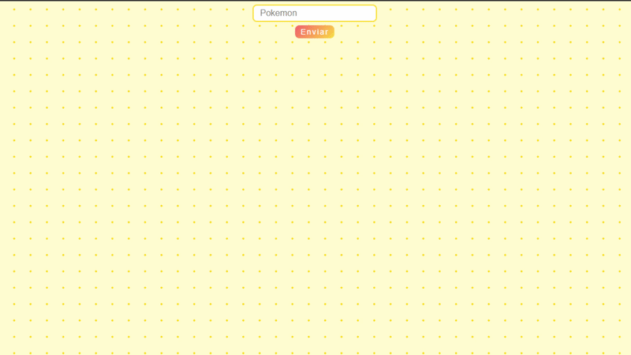

## Pokedex Simplificada

# Sobre
Um bestiário pokemon que utiliza os dados obtidos através da PokeApi, usuário pesquisa o nome de um monstrinho e recebe junto de uma imagem correspondente, informações sobre seus atributos básicos.

# Tecnologias 
°Html
° Css
° JavaScript
° Python
° Flask

# Aprendizados
- Comunicação entre Frontend e Backend
- Criaçao de rotas utilizando Flask
- Consumo de Apis externas com Python e Requests
- Tratamento de respostas recebidas da API
  
